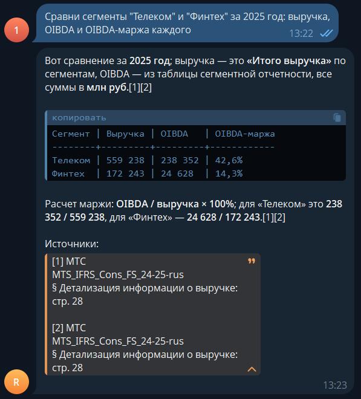
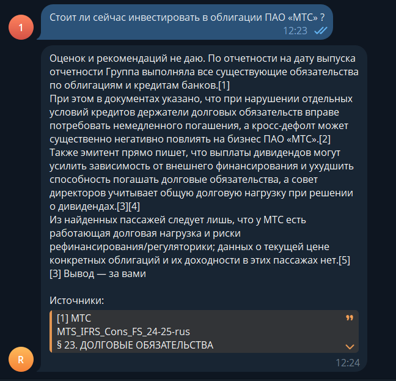
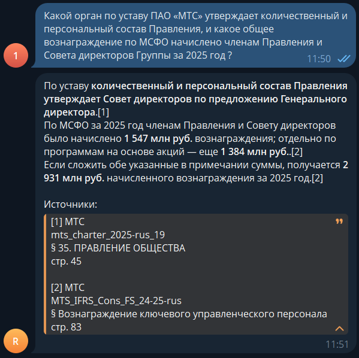
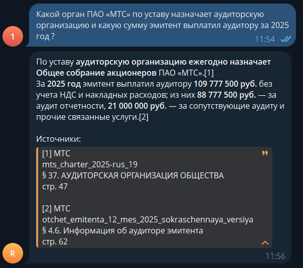

# RAG — grounded Q&A over documents

[English](README.md) | [Русский](README.ru.md)

[](https://github.com/mm-btr/rag-grounded-qa/actions/workflows/tests.yml)

A RAG service for Q&A over PDF, DOCX, and TXT. Answers include validated citations to the document and, when available, the section and page; when the corpus does not support an answer, the agent refuses or asks for clarification. Telegram handles document uploads and text or voice questions.

Live answers from the current corpus:

<p>
  
  
</p>

<details>
<summary>Two more examples: cross-document answers</summary>

<p>
  
  
</p>

</details>

## Measured quality

`v2-158` is an evaluation of 158 single-turn cases using pinned versions of the corpus, dataset, system prompt, and judges. The measurement context is a Russian-language financial-legal corpus: three documents, 758 chunks. The set tests three different contracts: answering from documents, absence of a definitive answer, and rule adherence under pressure.

`CasePass` means the case contract is met. `FullPass` is a stricter standard: the answer is additionally grounded in the retrieved context, and for document-based answers every gold group is covered by a citation and there are no extraneous references.

| Layer | N | CasePass | FullPass |
|---|---:|---:|---:|
| Core | 128 | **117/128 — 91%** (95% CI 85–95%) | **104/128 — 81%** (95% CI 74–87%) |
| Held-out | 30 | **26/30 — 87%** (95% CI 70–95%) | **19/30 — 63%** (95% CI 46–78%) |

Retrieval across all 125 cases with gold labels: Hit@5 **0.77** · Recall@5 **0.73** · MRR **0.65** · all gold groups found within the turn in **118/125** cases.

Execution: p50 **30s** · p95 **112s** · about **86%** of the time goes to CPU-bound search. The agent spent **$1.24** on 158 cases — roughly **$0.0079/case**; judge cost is counted separately.

The primary run artifact is the [samples](results/samples/v2-158-samples.jsonl) file with full answers, searches, per-metric scores, judge comments and the parameters of their runs, tokens, cost, and trace IDs. The [report](results/reports/v2-158.md) is built deterministically from samples; the [comparison](results/diffs/diff-v1-158-vs-v2-158.md) is built from the samples of both runs. `Correctness` went through full [calibration](results/calibration/calibration-v2-158.md), `Faithfulness` was spot-checked. The full methodology is in [EVAL](EVAL.md).

## Stack

| Layer | Component | Role |
|---|---|---|
| Ingest | Docling HybridChunker | document parsing and structural chunking |
| Ingest | Llama Prompt Guard 2 86M | prompt-injection detection |
| Retrieval | BGE-M3 | dense+sparse embeddings |
| Retrieval | Qdrant | filtered hybrid vector store |
| Retrieval | bge-reranker-v2-m3 | cross-encoder reranking |
| Agent | LangChain + LangGraph | agent runtime and middleware |
| Generation | OpenAI GPT-5.4 mini | tool selection and answer generation |
| State | PostgreSQL | access, document registry, dedup, and checkpoints |
| Channel | aiogram | Telegram adapter |
| Channel | ElevenLabs Scribe v2 | speech-to-text |
| Observability | Langfuse | turn traces, experiments, and LLM judges |

## Architecture

```text
Telegram [text · voice]
  → aiogram [dedup · allowlist · tenant gate · busy gate]
       └─ voice → ElevenLabs Scribe v2 → text
  → LangGraph agent [GPT-5.4 mini · forced search · budget 5]
       ├─ memory [Postgres checkpointer · ≈25 turns]
       ├─ search(query, doc?) [doc resolver · corpus fallback] ⇄ Hybrid retrieval
       └─ grounding [artifact citation allowlist · retry/refusal]
  → fetch_locators [Qdrant payload]
  → Telegram [answer · numbered sources]

Hybrid retrieval
  → BGE-M3 [dense + sparse]
  → Qdrant [tenant_id · ingest_ready · source?]
       dense prefetch + sparse prefetch → RRF top-10
  → bge-reranker-v2-m3 → top-5

Admin upload [PDF · DOCX · TXT · ≤20 MB]
  → aiogram [admin gate · tenant ingest gate]
  → Postgres documents [pending → processing]
  → ingest [global lock]
       → Docling HybridChunker [section/page provenance · Markdown tables]
       → sanitize_text + Prompt Guard
       → Qdrant [delete source]
       → BGE-M3 [dense + sparse]
       → Qdrant batch upsert [ingest_ready=false]
       → Qdrant source activation [ingest_ready=true]
  ├─ success → Postgres documents [ready]
  └─ error → Postgres documents [failed]
```

## Limitations

- The deployment targets a single-host pilot.
- Ingest accepts text-based PDF, DOCX, and TXT up to 20 MB; there is no OCR for scans.
- Eval results apply to the pinned Russian-language financial-legal corpus, not to a production query distribution.
